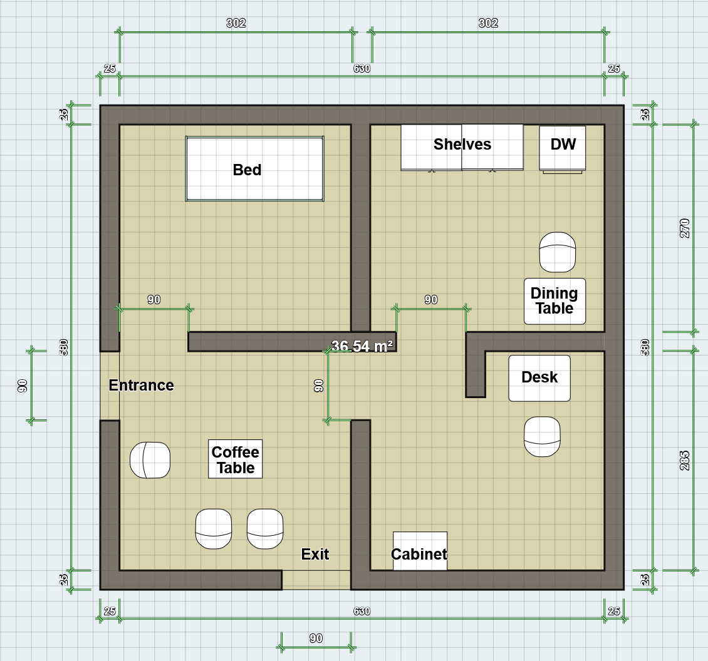
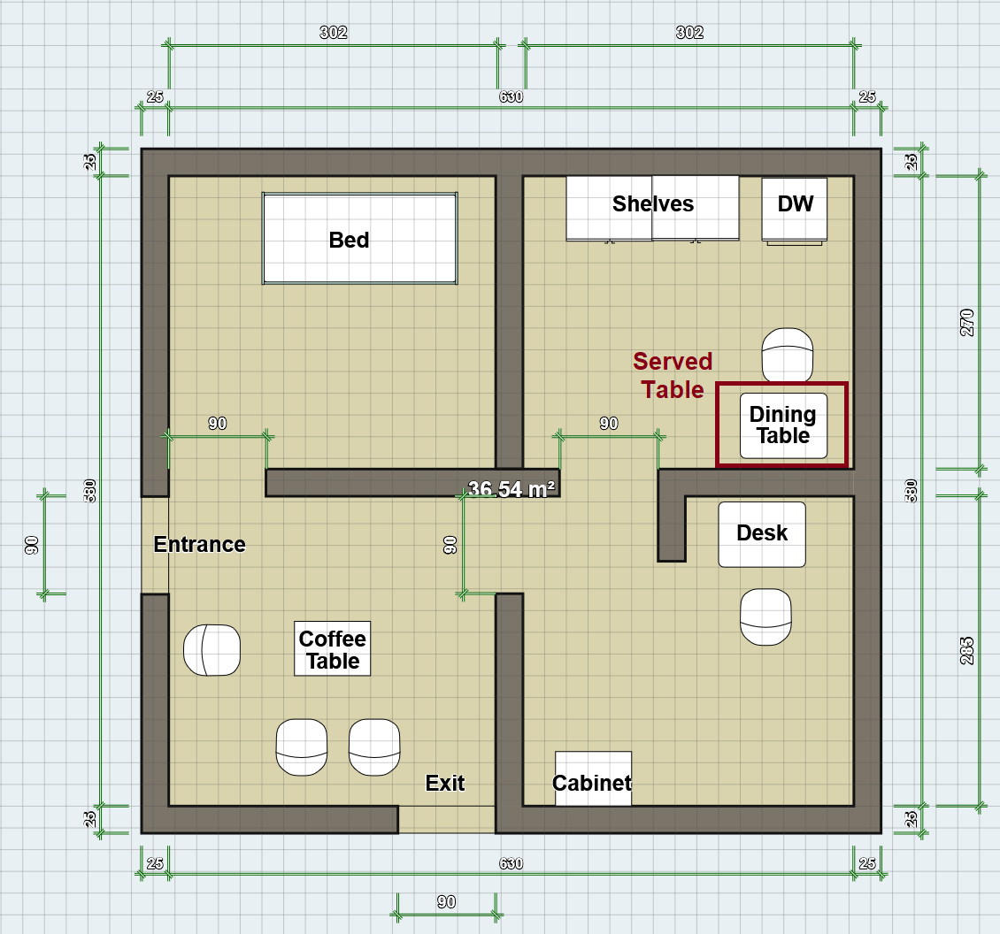
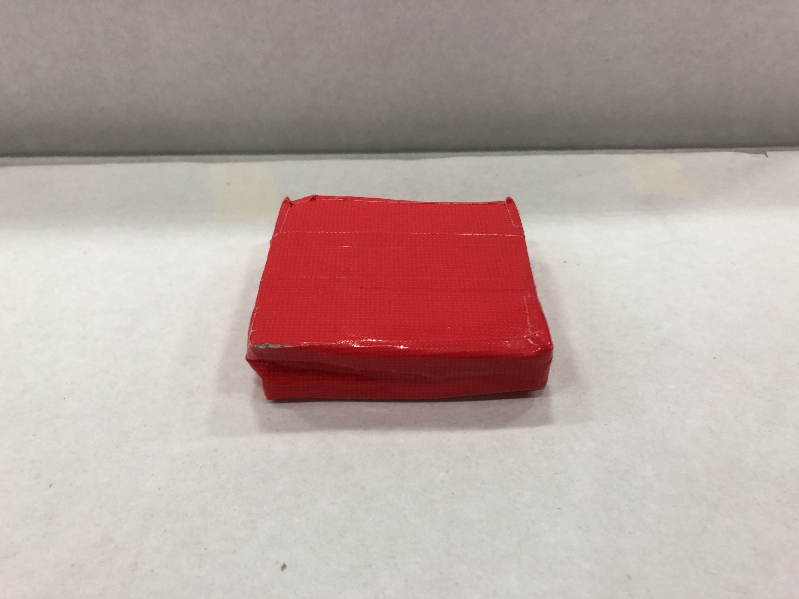

# Robocup Malaysia Open 2025 @Home League

## Table of contents
- [Rules](#rules)
- [Teams](#teams)
  - [@Home Open Platform League](#home-open-platform-league)
  - [@Home Education](#home-education)
- [Scores](#scores)
  - [@Home OPL](#home-opl)
    - [Final](#final)
    - [Ranking and Scores](#ranking-and-scores)
    - [Stage 1](#stage-1)
    - [Stage 2](#stage-2)
  - [@Home EDU](#home-edu)
    - [Final](#final-1)
    - [Special Awards](#special-awards)
    - [Ranking and Scores](#ranking-and-scores-1)
- [Schedules](#schedules)
  - [Setup Day: 14 August 2025](#setup-day-14-august-2025)
    - [Robot Inspection (OPL Only)](#robot-inspection-opl-only)
  - [Day 1: 15 August 2025](#day-1-15-august-2025)
    - [@Home OPL Arena](#home-opl-arena)
    - [@Home EDU Arena](#home-edu-arena)
  - [Day 2: 16 August 2025](#day-2-16-august-2025)
    - [@Home OPL Arena](#home-opl-arena-1)
    - [@Home EDU Arena](#home-edu-arena-1)
  - [Final: 17 August 2025](#final-17-august-2025)
    - [@Home OPL Arena](#home-opl-arena-2)
    - [@Home EDU Arena](#home-edu-arena-2)
- [Arena Layout](#arena-layout)
- [Task Information](#task-information)
  - [Robot Inspection](#robot-inspection)
  - [Carry My Luggage](#carry-my-luggage)
  - [General Purpose Service Robot](#general-purpose-service-robot)
  - [Receptionist](#receptionist)
  - [Serve Breakfast](#serve-breakfast)
  - [Storing Groceries](#storing-groceries)
  - [Clean the Table](#clean-the-table)
  - [Enhanced General Purpose Service Robot](#enhanced-general-purpose-service-robot)
  - [Restaurant](#restaurant)
  - [Find My Mate](#find-my-mate)
- [List of Items](#list-of-items)

## Rules
- [Rule for @HomeOPL ](./rules/at-home-robocup-my-2025.pdf)
- [Rule for @HomeEDU ](./rules/at-home-edu-robocup-my-2025.pdf)

## Teams
### @Home Open Platform League
- UTAR
- UniMAP MechaMinds
- Infinity Titan (USM)
- UM

### @Home Education
- UTAR
- UniMAP Automa
- UniMAP MechaBois
- UTM AIROST
- 404 Found (UTHM)

## Scores
### @Home OPL
#### Final
| #   | Team name            | Task score (50%) | Final Internal Jury (25%) | Final External Jury (25%) | Total (100%) |
| --- | -------------------- | ---------------- | ------------------------- | ------------------------- | ------------ |
| 🥇  | TBD                 | -                | -                         | -                         | -            |
| 🥈  | TBD                 | -                | -                         | -                         | -            |

#### Ranking and Scores
| #   | Team name            | Poster | Stage1 | State2 |  Total  |
| --- | -------------------- | ------ | ------ | ------ | ------- |
| 1   | UM                   | 8      | 645    | -      | 658.0   |
| 3   | UniMAP MechaMinds    | 7.75   | ⠀25    | -      | ⠀32.75  |
| 3   | UTAR                 | 8.375  | ⠀15    | -      | ⠀23.375 |
| 4   | Infinity Titan (USM) | 8.25   | ⠀⠀0    | -      | ⠀8.25   |

#### Stage 1
| Team name            | Carry My Luggage | General Purpose Service Robot (GPSR) | Receiptionist | Serve Breakfast | Storing Groceries | Total |
| -------------------- | ---------------- | ------------------------------------ | ------------- | --------------- | ----------------- | ----- |
| UTAR                 | 0                | 0                                    | 0             | -               | 15                | 15    |
| UniMAP MechaMinds    | 0                | 0                                    | 10            | -               | 15                | 25    |
| Infinity Titan (USM) | 0                | 0                                    | 0             | -               | 0                 | 0     |
| UM                   | 15               | 200                                  | 255           | -               | 175               | 645   |

#### Stage 2
| Team name            | Clean the Table  | Enhanced General Purpose Service Robot (EGPSR) | Restaurant | Stickler for the Rules | Total |
| -------------------- | ---------------- | ---------------------------------------------- | ---------- | ---------------------- | ----- |
| UTAR                 | -                | -                                              | -          | -                      | -     |
| UniMAP MechaMinds    | -                | -                                              | -          | -                      | -     |
| Infinity Titan (USM) | -                | -                                              | -          | -                      | -     |
| UM                   | -                | -                                              | -          | -                      | -     |

### @Home EDU
#### Final
| #   | Team name            | Task score (50%) | Final Internal Jury (25%) | Final External Jury (25%) | Total (100%) |
| --- | -------------------- | ---------------- | ------------------------- | ------------------------- | ------------ |
| 🥇  | TBD                 | -                | -                         | -                         | -            |
| 🥈  | TBD                 | -                | -                         | -                         | -            |
| 🥉  | TBD                 | -                | -                         | -                         | -            |

#### Special Awards
| Award                                        | Team name |
| -------------------------------------------- | --------- |
| TBA                                          | -         |

#### Ranking and Scores
| #   | Team name         | Poster | Carry my luggage | Find my mates | Receptionist | Total   |
| --- | ----------------- | ------ | ---------------- | ------------- | ------------ | ------- |
| 1   | UTM AIROST        | 7.5    | 250              | -             | -            | 257.5   |
| 2   | 404 Found (UTHM)  | 0      | 200              | -             | -            | 200     |
| 3   | UTAR              | 8.375  | 50               | -             | -            | 58.375  |
| 4   | UniMAP Automa     | 7      | 50               | -             | -            | 57      |
| 4   | UniMAP MechaBois  | 7      | 50               | -             | -            | 57      |

## Schedules

### Setup Day: 14 August 2025

#### Robot Inspection (OPL Only)

| Team                     | Status |
| ------------------------ | ------ |
| UTAR                     | ✅    |
| UniMAP MechaMinds        | ✅    |
| Infinity Titan (USM)     | ✅    |
| UM                       | ✅    |

***

### Day 1: 15 August 2025

#### @HOME OPL Arena

> **🕤 09.30 - Carry My Luggage**
> 
> | Test                   | Volunteer                | Jury1                     | Jury2                     |
> |------------------------|--------------------------|---------------------------|---------------------------|
> | UniMAP MechaMinds      | UTAR                     | UM                        | Infinity Titan (USM)      |
> | UTAR                   | UM                       | Infinity Titan (USM)      | UniMAP MechaMinds         |
> | UM                     | Infinity Titan (USM)     | UniMAP MechaMinds         | UTAR                      |
> | Infinity Titan (USM)   | UniMAP MechaMinds        | UTAR                      | UniMAP MechaMinds         |
> 
> **🕥	 10.30 - General Purpose Service Robot (GPSR)**
> 
> | Test                   | Volunteer                | Jury1                     | Jury2                     |
> |------------------------|--------------------------|---------------------------|---------------------------|
> | UTAR                   | UM                       | Infinity Titan (USM)      | UniMAP MechaMinds         |
> | UM                     | Infinity Titan (USM)     | UniMAP MechaMinds         | UTAR                      |
> | Infinity Titan (USM)   | UniMAP MechaMinds        | UTAR                      | UM                        |
> | UniMAP MechaMinds      | UTAR                     | UM                        | Infinity Titan (USM)      |
> 
> **🕦 11.30 - Storing Groceries**
> 
> | Test                   | Volunteer                | Jury1                     | Jury2                     |
> |------------------------|--------------------------|---------------------------|---------------------------|
> | UM                     | Infinity Titan (USM)     | UniMAP MechaMinds         | UTAR                      |
> | Infinity Titan (USM)   | UniMAP MechaMinds        | UTAR                      | UM                        |
> | UniMAP MechaMinds      | UTAR                     | UM                        | Infinity Titan (USM)      |
> | UTAR                   | UM                       | Infinity Titan (USM)      | UniMAP MechaMinds         |
> 
> **🕝 14.30 - Receptionist**
> 
> | Test                   | Volunteer                | Jury1                     | Jury2                     |
> |------------------------|--------------------------|---------------------------|---------------------------|
> | Infinity Titan (USM)   | UniMAP MechaMinds        | UTAR                      | UM                        |
> | UniMAP MechaMinds      | UTAR                     | UM                        | Infinity Titan (USM)      |
> | UTAR                   | UM                       | Infinity Titan (USM)      | UniMAP MechaMinds         |
> | UM                     | Infinity Titan (USM)     | UniMAP MechaMinds         | UTAR                      |

#### @HOME EDU Arena

> **🕥 10.30 - Carry My Luggage**
> 
> | Test              | Volunteer         | Jury1          | Jury2          |
> |-------------------|-------------------|----------------|----------------|
> | UniMAP Automa      | UniMAP MechaBois  | UTM AIROST         | UTAR               |
> | UniMAP MechaBois   | UTM AIROST        | UTAR               | 404 Found (UTHM)   |
> | UTM AIROST         | UTAR              | 404 Found (UTHM)   | UniMAP Automa      |
> | UTAR               | 404 Found (UTHM)  | UniMAP Automa      | UniMAP MechaBois   |
> | 404 Found (UTHM)   | UniMAP Automa     | UniMAP MechaBois   | UTM AIROST         |
> 
> **🕝 14.30 - Find My Mates**
> 
> | Test              | Volunteer         | Jury1          | Jury2          |
> |-------------------|-------------------|----------------|----------------|
> | UniMAP MechaBois   | UTM AIROST        | UTAR               | 404 Found (UTHM)   |
> | UTM AIROST         | UTAR              | 404 Found (UTHM)   | UniMAP Automa      |
> | UTAR               | 404 Found (UTHM)  | UniMAP Automa      | UniMAP MechaBois   |
> | 404 Found (UTHM)   | UniMAP Automa     | UniMAP MechaBois   | UTM AIROST         |
> | UniMAP Automa      | UniMAP MechaBois  | UTM AIROST         | UTAR               |

***

### Day 2: 16 August 2025

#### @HOME OPL Arena

> **🕤 09.30 - Serve Breakfast**
> 
> | Test                   | Volunteer                | Jury1                     | Jury2                     |
> |------------------------|--------------------------|---------------------------|---------------------------|
> | UniMAP MechaMinds      | UTAR                     | UM                        | Infinity Titan (USM)      |
> | UTAR                   | UM                       | Infinity Titan (USM)      | UniMAP MechaMinds         |
> | UM                     | Infinity Titan (USM)     | UniMAP MechaMinds         | UTAR                      |
> | Infinity Titan (USM)   | UniMAP MechaMinds        | UTAR                      | UniMAP MechaMinds         |
>
> **🕥 10.30 - Enhanced General Purpose Service Robot (GPSR)**
> 
> | Test                   | Volunteer                | Jury1                     | Jury2                     |
> |------------------------|--------------------------|---------------------------|---------------------------|
> | UTAR                   | UM                       | Infinity Titan (USM)      | UniMAP MechaMinds         |
> | UM                     | Infinity Titan (USM)     | UniMAP MechaMinds         | UTAR                      |
> | Infinity Titan (USM)   | UniMAP MechaMinds        | UTAR                      | UM                        |
> | UniMAP MechaMinds      | UTAR                     | UM                        | Infinity Titan (USM)      |
> 
> **🕦 11.30 - Stickler for the Rules**
> 
> | Test                   | Volunteer                | Jury1                     | Jury2                     |
> |------------------------|--------------------------|---------------------------|---------------------------|
> | UM                     | Infinity Titan (USM)     | UniMAP MechaMinds         | UTAR                      |
> | Infinity Titan (USM)   | UniMAP MechaMinds        | UTAR                      | UM                        |
> | UniMAP MechaMinds      | UTAR                     | UM                        | Infinity Titan (USM)      |
> | UTAR                   | UM                       | Infinity Titan (USM)      | UniMAP MechaMinds         |
> 
> **🕝 14.30 - Clean the Table**
> 
> | Test                   | Volunteer                | Jury1                     | Jury2                     |
> |------------------------|--------------------------|---------------------------|---------------------------|
> | Infinity Titan (USM)   | UniMAP MechaMinds        | UTAR                      | UM                        |
> | UniMAP MechaMinds      | UTAR                     | UM                        | Infinity Titan (USM)      |
> | UTAR                   | UM                       | Infinity Titan (USM)      | UniMAP MechaMinds         |
> | UM                     | Infinity Titan (USM)     | UniMAP MechaMinds         | UTAR                      |
>
> **🕟	16.30 - Restaurant**
> 
> | Test                     | Volunteer            | Jury1                  | Jury2                  |
> |--------------------------|----------------------|------------------------|------------------------|
> | UniMAP MechaMinds        | UTAR                 | UM                     | Infinity Titan (USM)   |
> | UTAR                     | UM                   | Infinity Titan (USM)   | UniMAP MechaMinds      |
> | UM                       | Infinity Titan (USM) | UniMAP MechaMinds      | UTAR                   |
> | Infinity Titan (USM)     | UniMAP MechaMinds    | UTAR                   | UniMAP MechaMinds      |

#### @HOME EDU Arena

> TBA

***

### Final: 17 August 2025

#### @HOME OPL Arena

> TBA

#### @HOME EDU Arena

> TBA

## Arena Layout

## Task Information

### Robot Inspection

### Carry My Luggage

**Note:** 
- You can select the location for the luggage, either on _the bed_ or on _the floor_.

### General Purpose Service Robot

### Receptionist

**Note:** 
- Host name is _Ana_.
- Her favourite drink is _water_.

### Serve Breakfast

### Storing Groceries

**Note:** 
- Objects are placed on _the dining table_.
- _Two tables in the kitchen_ (not the dining table) are used as _kitchen cabinets_ for storing different types of objects.
- There is no cabinet door and the bonus for opening cabinet door cannot be obtained.

### Clean the Table

**Note:** 
- _The dishwasher tab_ is placed on the table next to the dishwasher.

### Enhanced General Purpose Service Robot

No additional information.

### Restaurant

TBA

### Stickler for rules

**Note:** 
- No guests are allowed in _the bedroom_.

### Find My Mate

## List of Items
- [List of names](./names/names.md)
- [List of drinks](./names//drinks.md)
- [List of room](./maps/room_names.md)
- [List of locations](./maps/location_names.md)
- [List of known objects](./objects/objects.md)
